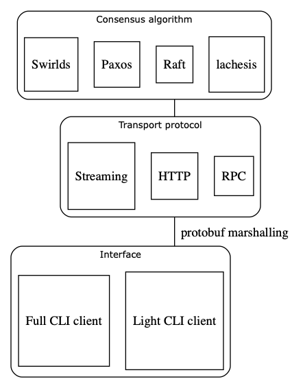

lachesis-rs
===========
[](https://travis-ci.org/Fantom-foundation/lachesis-rs)

Lachesis BFT consensus for permission-less networks, in Rust.

## RFCs

https://github.com/Fantom-foundation/fantom-rfcs

## Architecture
Each layer will have 1 or more library crates, for shared functionality and traits. Square borders refer to crates, rounded borders refers to logical distinctions, with a shared interface.



<!--
digraph {
    graph [fontsize=10 fontname="Verdana" compound=true];
    bgcolor=transparent;

    lach[label="lachesis", shape=square]    
    raft[label="Raft", shape=square]
    paxos[label="Paxos", shape=square]
    rpc[label="RPC", shape=square]
    http[label="HTTP", shape=square]
    streaming[label="Streaming", shape=square]
    light[label="Light CLI client", shape=square]
    full[label="Full CLI client", shape=square]
    
    subgraph cluster_consensus {
        bgcolor=white;
        style="rounded"
        labelloc="t";
        label="Consensus algorithm";
        {rank=same lach raft paxos}
    }
    
    subgraph cluster_protocol {
        bgcolor=white;
        style="rounded"
        labelloc="t";
        label="Transport protocol";
        rank=same;
        rpc http streaming
    }
    
    subgraph cluster_interface {
        bgcolor=white;
        style="rounded"
        labelloc="interface";
        label="Interfaces";
        rank=same;
        light full
    }
    
    raft->http[ltail=cluster_consensus,lhead=cluster_protocol,color="black"];
    http->light[ltail=cluster_protocol,lhead=cluster_interface,color="black"];
}
-->

## Developer guide

Install the latest version of [Rust](https://www.rust-lang.org). We tend to use nightly versions. [CLI tool for installing Rust](https://rustup.rs).

We use [rust-clippy](https://github.com/rust-lang-nursery/rust-clippy) linters to improve code quality.

There are plenty of [IDEs](https://areweideyet.com) and other [Rust development tools to consider](https://github.com/rust-unofficial/awesome-rust#development-tools).

### Step-by-step guide
```bash
# Install Rust (nightly)
$ curl https://sh.rustup.rs -sSf | sh -s -- --default-toolchain nightly
# Install cargo-make (cross-platform feature-rich reimplementation of Make)
$ cargo install --force cargo-make
# Install rustfmt (Rust formatter)
$ rustup component add rustfmt
# Clone this repo
$ git clone https://github.com/Fantom-foundation/lachesis-rs && cd lachesis-rs
# Run tests
$ cargo test
# Format, build and test
$ cargo make
```
